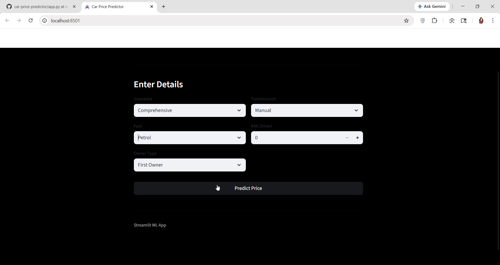
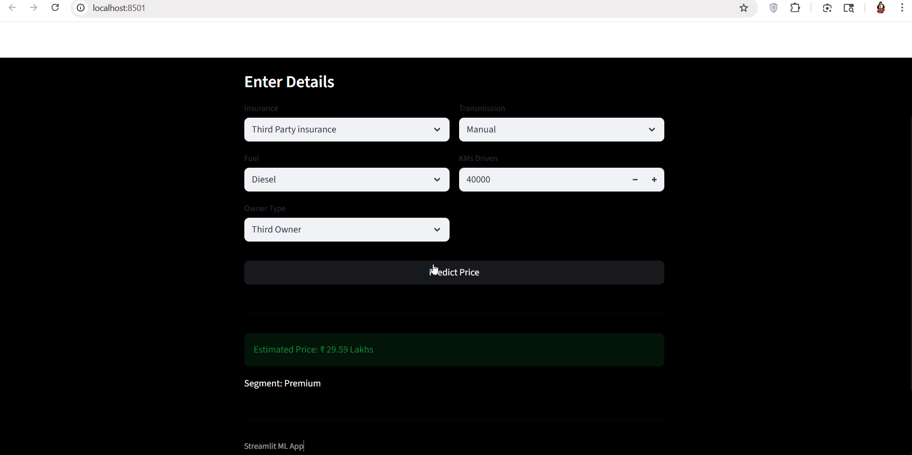

# 🚗 Used Car Price Predictor

A simple Machine Learning web app built using Streamlit that predicts the resale price of a used car based on key features like fuel type, insurance, ownership, and kilometers driven.

---

## 📌 Features

* Predict car resale price instantly
* Clean and minimal UI (black theme)
* Uses trained ML model (`final_model.pkl`)
* Fast and lightweight Streamlit app
* Simple input-based prediction

---

## 📸 Screenshots

### 🏠 Input Interface



### 💰 Prediction Result




## 🧠 Model Inputs

The model uses the following features:

* Insurance Type
* Fuel Type
* Kilometers Driven
* Owner Type
* Transmission

---

## 🛠️ Tech Stack

* Python
* NumPy
* Pickle
* Streamlit

---

## 📂 Project Structure

```
project/
│
├── app.py
├── final_model.pkl
└── README.md
```

---

## ▶️ How to Run

1. Install dependencies:

```
pip install streamlit numpy
```

2. Run the app:

```
streamlit run app.py
```

3. Open in browser:

```
http://localhost:8501
```

---

## ⚙️ Model Details

* Pre-trained ML model saved as `final_model.pkl`
* Uses encoded categorical features
* Outputs predicted price in Lakhs

---

## 📊 Example Output

```
Estimated Price: ₹ 6.75 Lakhs
```

---

## ⚠️ Note

* Ensure `final_model.pkl` is in the same directory as `app.py`
* Input values must match training format
* This is a basic ML project for learning/demo purposes

---

## 👨‍💻 Author

* Eshmit

---

## 🚀 Future Improvements

* Add more features (car brand, year, etc.)
* Improve model accuracy
* Deploy online (Streamlit Cloud / Render)
* Add graphs and insights

---
